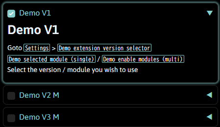

# sd_webui_multi_version_extension_demo

this is a demo extension to show how you may have create an an extension that has multiple variations / versions or modules that can enabled in settings for [Stable Diffusion web UI](https://github.com/AUTOMATIC1111/stable-diffusion-webui)

the reason of creating this demo is that Stable Diffusion web UI extensions
index received a [Pull request](https://github.com/AUTOMATIC1111/stable-diffusion-webui-extensions/pull/375) to add multiple extensions of the same nature with slight variation to the means that the same tasks is achieved
I presume the author of those extensions intent is to give the user choice on which version they like, but adding multiple extension like this for clutter the index.

